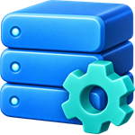

# Центр администрирования 1С

Бесплатное Windows-приложение для управления службами, информационными базами и сеансами серверов 1С. Позволяет работать с несколькими серверами разных версий платформы в одном окне, в том числе через VPN.

[Скачать последнюю версию](https://github.com/PlotnikovDL/AdminConsoleFor1C/releases/latest) · [Сообщить об ошибке](https://github.com/PlotnikovDL/AdminConsoleFor1C/issues) · [Лицензия MIT](LICENSE)

Текущий релиз — **[1.2.0](https://github.com/PlotnikovDL/AdminConsoleFor1C/releases/tag/v1.2.0)**. [Что изменилось](docs/releases/1.2.0.md).

## Что нового в 1.2.0

Разделы «Информационные базы» и «Сеансы» используют одинаковую панель «Сервер → Кластер → База → Поиск» и единую команду «Обновить». При первом открытии автоматически загружается общий список, а при возвращении — сохранённая область просмотра. Фильтры и автообновление сохраняются до закрытия приложения. Локальные серверы идут перед удалёнными, порты одного компьютера — по возрастанию. Выбор кластера подставляет его сервер, а сервер с единственным кластером выбирает его автоматически. Подробные правила описаны в [docs/server-view-consistency.md](docs/server-view-consistency.md).

Редактирование параметров существующих баз пока не входит в релиз.

## Возможности

- Регистрация, запуск, остановка и удаление локальных служб агента 1С.
- Выбор учётной записи службы, каталога данных, портов и параметров отладки.
- Просмотр процессов платформы.
- Подключение к нескольким локальным и удалённым серверам, включая доступ через VPN.
- Автоматическое обнаружение локальных служб агента с указанием версии, порта и состояния.
- Просмотр и создание пустых серверных баз с проверкой конкретного сервера, версии платформы и кластера.
- Просмотр и завершение сеансов на серверах разных версий платформы.

Интерфейс выполнен в стиле Windows 11 на стандартных WinUI 3 и Windows Community Toolkit контролах.

## Установка

Скачайте `AdminConsoleFor1C-<версия>-win-x64-setup.exe` из [GitHub Releases](https://github.com/PlotnikovDL/AdminConsoleFor1C/releases/latest) и запустите установщик.
Установщик размещает приложение в `Program Files\AdminConsoleFor1C` и создаёт ярлык в меню «Пуск».
Обновление устанавливается поверх предыдущей версии. Удаление доступно через «Параметры → Приложения».
Сохранённые подключения не удаляются вместе с программой.

Минимальные требования: Windows 10 2004 (сборка 19041), архитектура x64. Основная платформа разработки и проверки — Windows 11.
.NET и Windows App SDK включены в установщик. Устанавливать тестовые сертификаты не требуется.
Первые EXE-релизы не имеют доверенной цифровой подписи: Windows может показать предупреждение неизвестного издателя или заблокировать запуск согласно настройкам безопасности.

Компоненты платформы 1С в дистрибутив не входят. Для администрирования нужны локальные `rac.exe`/`ras.exe` подходящих версий и сетевой доступ к серверу; локальная служба агента 1С для удалённого подключения не требуется.

### WinGet

Пакет `PlotnikovDL.AdminConsoleFor1C` опубликован в WinGet. [Заявка одобрена и принята 30 сентября 2026 года](https://github.com/microsoft/winget-pkgs/pull/435995). На 7 октября в каталоге доступна версия **1.1.1**; обновление **1.2.0** отправлено на проверку в [заявке №448261](https://github.com/microsoft/winget-pkgs/pull/448261). До его публикации используйте EXE из Releases.

```powershell
winget install --id PlotnikovDL.AdminConsoleFor1C --exact
```

## Подключение к серверу

1. Откройте раздел **«Сеансы»** или **«Информационные базы»**. Локальные службы и данные доступных серверов загрузятся автоматически; для нового удалённого сервера нажмите **«Добавить сервер»**.
2. Укажите адрес сервера, порт агента и подходящую версию компонентов платформы. При доступе через VPN сначала подключите VPN.
3. Укажите учётные данные администратора кластера, если они требуются, и сохраните подключение. Данные выбранного сервера прочитаются автоматически.
4. Добавьте остальные серверы. Используйте фильтры по серверу, кластеру и базе или общий список «Все». Сеансы можно искать и завершать с подтверждением.

Совпадение версий серверов между собой не требуется: для каждого подключения используются соответствующие компоненты администрирования. Сетевой доступ и права администратора 1С нужны отдельно для каждого сервера.

## Создание пустой серверной базы

Доступно начиная с **1.1.1**. Версия приложения видна в заголовке окна.

Зарегистрированные локальные службы агента появляются в выборе серверов автоматически, с портом, версией и состоянием службы. Список обновляется при открытии и возвращении в раздел, а также по кнопке «Обновить». Сохранённые подключения к удалённым серверам остаются доступны. Обнаруженные службы не записываются в файл подключений до явного сохранения через «Изменить подключение». Остановленная локальная служба отображается в списке, но создание базы доступно после её запуска и успешной проверки кластера.

1. Откройте **«Информационные базы»**. Выберите обнаруженную локальную службу или сохранённое подключение. Для нового удалённого сервера нажмите **«Добавить сервер»** и укажите адрес, порт агента и полную версию платформы. Подключения общие с разделом «Сеансы».
2. Дождитесь проверки фактической версии сервера. Единственный кластер выбирается автоматически; если их несколько, укажите нужный. Если сервер работает на другой сборке, исправьте подключение. Выбор версии в консоли не меняет установленную платформу сервера.
3. Нажмите **«Создать базу»**, заполните имя ИБ, тип СУБД, сервер и имя базы данных, пользователя и пароль СУБД. Сервер СУБД указывается отдельно от сервера 1С и должен быть доступен с сервера 1С.
4. При необходимости измените язык, смещение дат, защищённое соединение, выполнение регламентных заданий и выдачу лицензий в дополнительных параметрах. Флажок «Создать базу данных, если она отсутствует» соответствует штатному параметру 1С.
5. Нажмите **«Далее»**, проверьте сервер, версию, кластер и параметры СУБД, затем **«Создать базу»**. После подтверждения сервером список обновится.

Создаётся пустая серверная ИБ без конфигурации. Шаблоны конфигураций и файловые базы в этот сценарий пока не входят. Пароль СУБД не сохраняется в настройках консоли. Перед отправкой команды повторно проверяются версия агента, адрес кластера и отсутствие ИБ с таким именем.

Если после отправки команды соединение оборвалось или истекло время ожидания, повторное создание в этом окне блокируется: закройте окно, обновите список ИБ и проверьте состояние базы в СУБД. Такая ошибка не доказывает, что база не была создана.

## Сборка

Требуются Windows, .NET SDK 10 и Visual Studio с инструментами WinUI/MSIX.

```powershell
powershell -NoProfile -ExecutionPolicy Bypass -File scripts\Build-Release.ps1
```

Скрипт собирает автономные приложение и вспомогательный процесс, проверяет состав поставки, создаёт EXE-установщик, SHA256 и манифесты WinGet в `artifacts\release`.
При первом запуске он загружает проверенную версию Inno Setup в `artifacts\tools` и устанавливает инструменты сборки для текущего пользователя.
Версия берётся из `src\AdminConsoleFor1C.App\Package.appxmanifest`: для EXE-релиза используется формат `major.minor.patch.0`.

Дополнительная сборка MSIX доступна через `scripts\Build-Release.ps1 -Format Msix`; для установки такого пакета требуется подпись.

## Данные и лицензия

Подключения хранятся в `%AppData%\AdminConsoleFor1C\server-connections.json`; пароли подключений в этот файл не сохраняются.
Временные результаты повышенных действий размещаются в `%LocalAppData%\AdminConsoleFor1C\Temp`.

Исходный код распространяется по [лицензии MIT](LICENSE). Лицензии сторонних компонентов включены в папку `Licenses` установленного приложения.
Техническое имя проекта — `AdminConsoleFor1C`, исполняемый файл — `AdminConsoleFor1C.App.exe`.

## UI-гайд

Интерфейс проектируется как нативная Windows 11 админ-консоль на WinUI 3 с опорой на Windows app design guidelines, Fluent Design и WinUI Gallery.

Подробные правила: [docs/ui-guidelines.md](docs/ui-guidelines.md)

## Стек

Согласованный стек и архитектурные ориентиры: [docs/technology-stack.md](docs/technology-stack.md)

## План развития

- Показывать полные сведения об информационных базах через `rac infobase info`: СУБД, сервер БД, имя базы, пользователя БД, описание и ограничения.
- Читать лицензии 1С и выводить данные по программным и аппаратным лицензиям: источник, состояние, владелец, регистрационный номер, привязка к компьютеру или ключу, доступность для сервера и клиентов.
